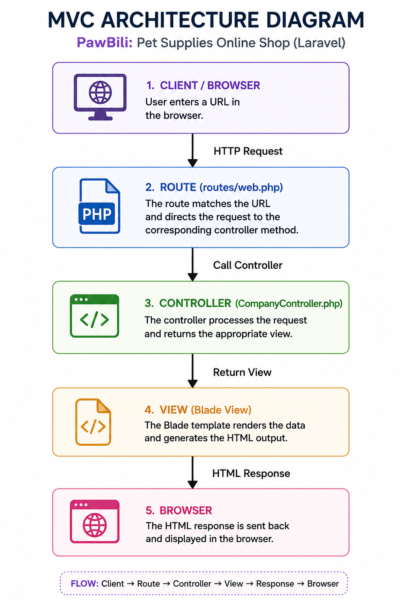

# PawBili: Pet Supplies Online Shop

A responsive multi-page company profile website for **PawBili**, a fictional online pet supplies shop, developed using the Laravel framework for the Week 3 Client-Server Technologies activity.

---

## 1. Project Title

**PawBili: Pet Supplies Online Shop**

---

## 2. Introduction

### What is a Company Profile Website?

A company profile website is an online platform that introduces a business, its identity, products or services, mission, vision, and contact information. It serves as a digital representation of a company and provides visitors with a convenient way to learn about the business.

### Why Businesses Need One

Businesses need an online presence to make information about their products and services accessible to customers. A company profile website can improve visibility, communicate a company's identity, establish credibility, and provide an easy way for customers to find important information.

### Purpose of the Project

For this project, a fictional company called **PawBili** was created.

PawBili is an online pet supplies shop that provides pet owners with convenient access to everyday pet products such as food, treats, grooming products, accessories, and wellness essentials.

The project demonstrates the use of Laravel features including:

- MVC architecture
- Laravel routing
- Controllers
- Blade templating
- Reusable layouts and components
- Responsive web design
- Git version control

---

## 3. Objectives

The main objectives of the project are to:

1. Develop a responsive multi-page company profile website using Laravel.
2. Implement Laravel routes for the required pages.
3. Create and use a `CompanyController`.
4. Apply the Model-View-Controller (MVC) architecture.
5. Use Blade templates and reusable components.
6. Create a reusable navigation bar and footer.
7. Develop Home, About, Services, and Contact pages.
8. Organize the project using Laravel's standard folder structure.
9. Apply responsive and consistent web design.
10. Use Git to track the development of the project through meaningful commits.

---

## 4. MVC Architecture

### What is MVC?

MVC stands for **Model-View-Controller**. It is an architectural pattern that separates an application's responsibilities into different components.

- **Model** – handles application data and database-related operations.
- **View** – handles the presentation and user interface.
- **Controller** – handles requests and connects the application's routes to the appropriate views.

### Why Laravel Uses MVC

Laravel follows the MVC architecture to help developers organize their applications and separate different responsibilities. This makes applications easier to maintain, understand, and expand.

### Advantages of MVC in Software Development

- Clear separation of concerns
- Easier maintenance and debugging
- Better scalability for larger applications
- Improved code reusability
- Cleaner collaboration in team projects

### Simple MVC Request Flow Diagram

```text
Browser
  │
  ▼
Route (web.php)
  │
  ▼
Controller
  │
  ▼
Blade View
  │
  ▼
Response to Browser
```

### PawBili MVC Components

- **Route**: `routes/web.php` maps URLs to controller methods.
- **Controller**: `CompanyController.php` handles requests and returns views.
- **View**: Blade files in `resources/views/pages/` render page content.

### Architecture Diagram



---

## 5. Laravel Routing

### What is Routing?

Routing determines how an application responds to requests made to specific URLs. In Laravel, routes connect URLs to controller methods.

### Named Routes

Named routes (`->name('home')`, etc.) provide readable references used in Blade links and redirects.

### GET Requests

This project uses `GET` routes because all required pages are read-only display pages.

### Route Definitions (`routes/web.php`)

```php
Route::get('/', [CompanyController::class, 'home'])->name('home');
Route::get('/about', [CompanyController::class, 'about'])->name('about');
Route::get('/services', [CompanyController::class, 'services'])->name('services');
Route::get('/contact', [CompanyController::class, 'contact'])->name('contact');
```

### Route Table

| URL | Controller Method | Route Name | Page |
|---|---|---|---|
| `/` | `home()` | `home` | Home |
| `/about` | `about()` | `about` | About |
| `/services` | `services()` | `services` | Services |
| `/contact` | `contact()` | `contact` | Contact |

### Route Definitions Screenshot

`/screenshots/pawbili others/route definitions.png`

---

## 6. Controllers

### Purpose of Controllers

Controllers handle incoming requests and determine what response should be returned to users. They keep route files clean and centralize request handling logic.

### Benefits of Controllers

- Cleaner route definitions
- Better code organization
- Easier maintenance and scaling
- Clear separation from presentation layer

### CompanyController Methods

- `home()` → returns `pages.home`
- `about()` → returns `pages.about`
- `services()` → returns `pages.services`
- `contact()` → returns `pages.contact`

### Controller Screenshot

`/screenshots/pawbili others/controller.png`

---

## 7. Blade Templating Engine

### What is Blade?

Blade is Laravel’s built-in templating engine used for creating dynamic and reusable UI templates.

### Blade Layouts

A shared layout is used at:

`resources/views/layouts/app.blade.php`

It contains the HTML skeleton and shared page structure.

### Blade Components

Reusable components:

- `resources/views/components/navbar.blade.php`
- `resources/views/components/footer.blade.php`

### Blade Directives Used

- `@extends`
- `@section`
- `@yield`
- `@include`

### Example

```blade
@extends('layouts.app')

@section('title', 'Home')

@section('content')
    <h1>Welcome to PawBili</h1>
@endsection
```

### Blade Layout Screenshot

`/screenshots/pawbili others/blade layout.png`

---

## 8. Laravel Folder Structure

```text
week03-company-profile/
│
├── app/
│   └── Http/
│       └── Controllers/
│           └── CompanyController.php
│
├── resources/
│   └── views/
│       ├── layouts/
│       ├── components/
│       └── pages/
│
├── routes/
│   └── web.php
│
├── public/
├── screenshots/
├── documentation/
└── README.md
```

### Folder Purposes

| Folder | Purpose |
|---|---|
| `app/` | Contains controllers and backend application logic. |
| `routes/` | Contains route definitions (`web.php`). |
| `resources/` | Contains Blade templates, CSS, and JS source files. |
| `public/` | Contains publicly accessible assets (images, compiled files). |
| `bootstrap/` | Laravel bootstrap files and app initialization. |
| `config/` | Laravel configuration files. |

---

## 9. Screenshots

### Home Page
.png)
.png)
.png)
.png)

### About Page
.png)
.png)
.png)
.png)
.png)

### Services Page
.png)
.png)
.png)

### Contact Page
.png)
.png)

### Route Definitions


### Controller


### Blade Layout


### Navigation Bar


### Footer


---

## 10. Problems Encountered

1. **Node.js and npm were initially unavailable**  
   `node` and `npm` were not recognized in PowerShell.

2. **Git was not initialized**  
   Error encountered: `fatal: not a git repository`.

3. **Initial commit was too large**  
   Most work was grouped into one commit, which did not satisfy meaningful commit requirements.

---

## 11. Solutions

1. **Node.js/npm fix**  
   Installed Node.js and verified using:
   - `node -v`
   - `npm -v`
   Then ran `npm install`.

2. **Git initialization fix**  
   Ran `git init` in the Laravel project root.

3. **Commit history fix**  
   Reorganized work into meaningful commits:
   - `feat: create Laravel project`
   - `feat: add company routes`
   - `feat: create CompanyController`
   - `feat: build reusable Blade layout and components`
   - `feat: build Home page`
   - `feat: build About page`
   - `feat: build Services page`
   - `feat: build Contact page`
   - `docs: update README`

---

## 12. Reflection

Developing the PawBili website helped me understand how Laravel organizes applications through the Model-View-Controller (MVC) architecture. Before this project, I mostly viewed websites as separate page files with HTML and CSS. Through Laravel, I learned that a request follows a structured flow: route, controller, then view. This made the development process clearer and more maintainable.

I learned that routing is not just URL mapping—it is the entry point of application behavior. In this project, each route in `web.php` was connected to a dedicated method in `CompanyController`. This gave me a stronger understanding of how Laravel receives user requests and decides what content to return.

Working with controllers showed me the value of organizing logic away from presentation. Instead of putting everything inside route closures, I used controller methods (`home`, `about`, `services`, `contact`) to return views cleanly. This approach made routes shorter, code easier to read, and future updates easier to implement.

Blade templating was another major learning area. By using a shared layout and reusable components (`navbar` and `footer`), I avoided repeating code across multiple pages. Blade directives like `@extends`, `@section`, `@yield`, and `@include` helped me structure files consistently. I also realized how reusable templates improve long-term maintainability and make UI updates faster.

I also appreciated the principle of separation of concerns. Keeping structure in Blade views, navigation logic in routes, and request handling in controllers made debugging easier. When something broke, I could quickly identify whether the issue came from routing, controller logic, or the view template.

Finally, this project improved my Git workflow. I learned that meaningful commits are important for documentation, collaboration, and progress tracking. Breaking tasks into clear commit stages made the project history understandable and professional.

Overall, this project gave me practical experience with MVC, Laravel routing, controllers, Blade templating, responsive layouting, and Git version control. These are essential foundations for building larger enterprise systems, where clean architecture and maintainable code are critical.

---

## 13. References (APA 7th Edition)

Laravel. (n.d.). *Laravel documentation*. https://laravel.com/docs

MDN Web Docs. (n.d.). *HTML: HyperText Markup Language*. https://developer.mozilla.org/en-US/docs/Web/HTML

MDN Web Docs. (n.d.). *CSS: Cascading Style Sheets*. https://developer.mozilla.org/en-US/docs/Web/CSS

PHP Documentation Group. (n.d.). *PHP manual*. https://www.php.net/docs.php

Tailwind Labs. (n.d.). *Tailwind CSS documentation*. https://tailwindcss.com/docs